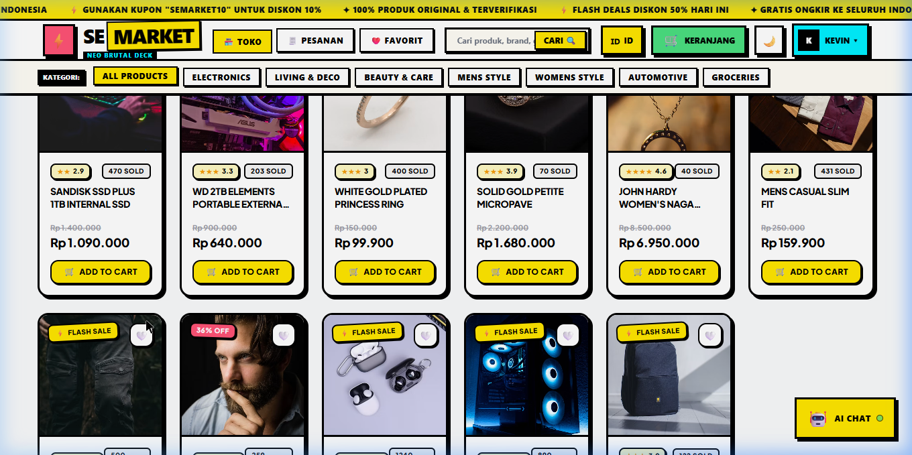
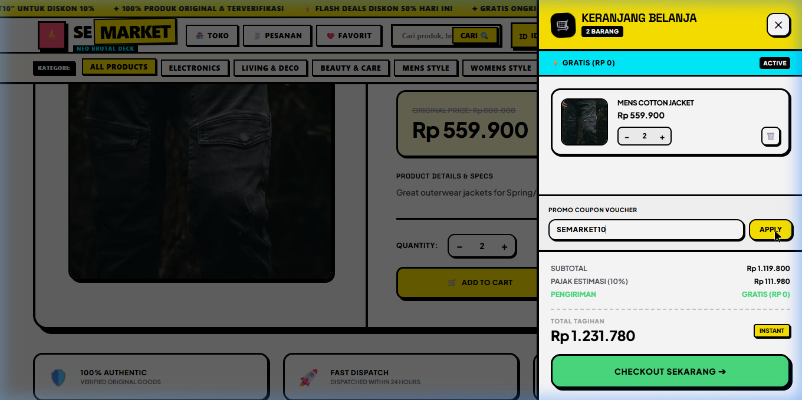
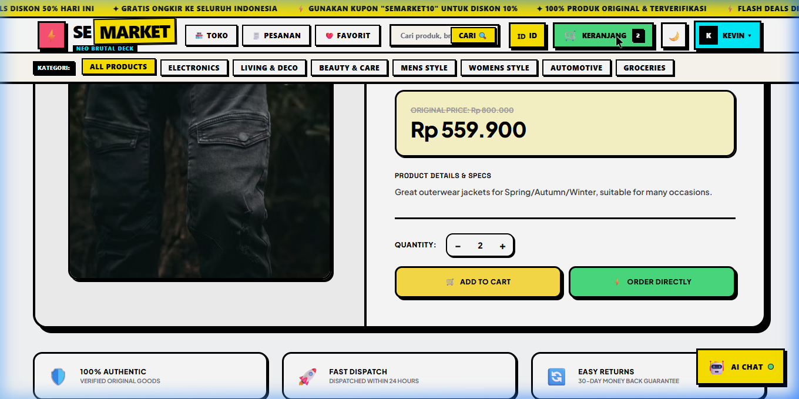
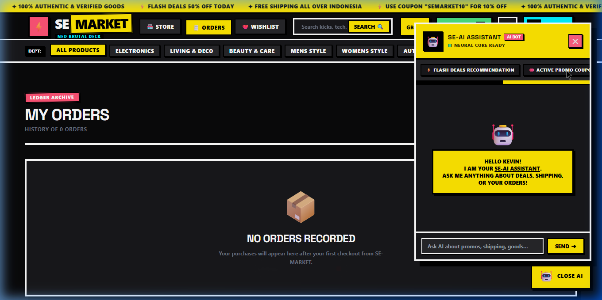

# SeMarketplace

Platform e-commerce dengan arsitektur mikro-kontainer, frontend bergaya **Neo-Brutalism**, backend **Golang REST API**, dan database **PostgreSQL 16**.

[](https://github.com/mazkev/Semarketplace/actions/workflows/deploy.yml)


---

## 📸 Antarmuka Aplikasi

### 1. Storefront & Katalog Produk
Antarmuka katalog produk dengan filter kategori, pencarian real-time, badge flash sale, dan sistem voucher diskon.



### 2. Slide-Over Keranjang Belanja & Kupon Promo
Perhitungan otomatis subtotal, estimasi pajak 10%, diskon kupon (`SEMARKET10`), dan checkout terintegrasi.



### 3. Detail Produk & Spesifikasi
Tampilan detail produk dengan selektor kuantitas dinamis dan badge garansi transaksi.



### 4. Mode Gelap & Asisten Belanja
Dukungan penuh tema gelap (Dark Mode) dan floating assistant untuk rekomendasi flash deal.



---

## 🏗️ Arsitektur Sistem

Aplikasi berjalan di atas arsitektur 3 kontainer Docker yang terisolasi dalam private bridge network:

```text
                      [ Client Browser ]
                              │ (HTTP :3000)
                              ▼
                 ┌─────────────────────────┐
                 │   Nginx Reverse Proxy   │
                 │   (Rate Limiter, SSL)   │
                 └────────────┬────────────┘
                              │
          ┌───────────────────┴───────────────────┐
          │ (Internal Network: semarket-network) │
          ▼                                       ▼
┌──────────────────┐                    ┌──────────────────┐
│  React Frontend  │                    │  Golang Backend  │
│  (Static Build)  │                    │  (:8080 Private) │
└──────────────────┘                    └─────────┬────────┘
                                                  │
                                                  ▼
                                        ┌──────────────────┐
                                        │  PostgreSQL 16   │
                                        │  (Volume Data)   │
                                        └──────────────────┘
```

1. **Gateway**: Nginx Alpine membuka port `:3000`, menangani static assets, rate limiting (5 req/menit pada auth endpoint), dan proxy `/api/*` ke backend.
2. **Backend**: Golang REST API berjalan di port private `:8080` (tidak diekspos ke publik), terhubung ke database melalui connection pool `pgx/v5`.
3. **Database**: PostgreSQL 16 Alpine menggunakan Docker persistent volume (`postgres-data`) dengan migrasi otomatis dari SQLite saat inisialisasi awal.

---

## ⚡ Hasil Optimasi Performa

| Komponen | Sebelum Optimasi | Sesudah Optimasi | Metrik Peningkatan |
| :--- | :--- | :--- | :--- |
| **Initial JS Bundle** | `326.81 kB` (Monolith) | **`11.92 kB`** (`index.js`) | **Penyusutan ~96%** via `React.lazy` |
| **Vendor Code** | Tercampur di bundle utama | **`140.87 kB`** (`vendor.js`) | Caching permanen browser |
| **Admin Module Load** | Ter-download semua user | **`71.75 kB`** (On-demand) | Dimuat hanya saat `#backOffice` |
| **Vite Build Time** | 10.60 detik | **3.23 detik** | **3.2x lebih cepat** |
| **Payload API** | JSON polos tanpa kompresi | **Gzip terkompresi** | **70–85% lebih hemat bandwidth** |
| **Database Query** | Full-Table Scan | **6 B-Tree Indexes** | Query index lookup O(log n) |
| **Analytics Calculation** | Tarik seluruh baris ke RAM Go | **SQL `GROUP BY` & `SUM`** | Komputasi langsung di DB engine |
| **Server Lifecycle** | `http.ListenAndServe` default | **Hardened `http.Server`** | Read: 10s, Write: 15s, Graceful Stop |
| **SQLite Driver** | Journal mode default (Locking) | **WAL Mode (Write-Ahead)** | Baca dan tulis konkuren |

---

## 🔐 Keamanan & Reliabilitas

- **JWT Authentication**: Token ditandatangani dengan algoritma HMAC-SHA256, diverifikasi pada endpoint terlindungi via middleware RBAC (`RequireAdmin`).
- **Nginx Rate Limiting**: `limit_req_zone` diterapkan untuk menahan serangan brute-force login dan abuse API.
- **Port Isolation**: Port database (:5432) dan backend (:8080) hanya dapat diakses melalui Docker internal network `semarket-network`.
- **HTTP Security Headers**: `X-Frame-Options: SAMEORIGIN`, `X-Content-Type-Options: nosniff`, `X-XSS-Protection`, dan `Referrer-Policy`.
- **Body Limit Middleware**: Membatasi payload request maksimal 1 MB untuk mencegah eksploitasi memory exhaustion.

---

## 📡 Daftar Endpoint API

| Method | Endpoint | Akses | Keterangan |
| :--- | :--- | :--- | :--- |
| `GET` | `/api/health` | Publik | Healthcheck service status |
| `POST` | `/api/auth/register` | Publik | Registrasi pengguna baru |
| `POST` | `/api/auth/login` | Publik | Login & penerbitan token JWT |
| `GET` | `/api/products` | Publik | Daftar katalog (dukung filter `?category=`) |
| `GET` | `/api/products/:id` | Publik | Detail produk berdasarkan ID |
| `POST` | `/api/products` | Admin | Menambah produk baru |
| `PUT` | `/api/products/:id` | Admin | Memperbarui informasi produk |
| `DELETE` | `/api/products/:id` | Admin | Menghapus produk |
| `GET` | `/api/orders` | User/Admin | Riwayat pesanan (dukung `?customerId=` & `?limit=`) |
| `POST` | `/api/orders` | User | Membuat pesanan baru |
| `PUT` | `/api/orders/:id` | Admin | Memperbarui status pesanan |
| `DELETE` | `/api/orders/:id` | Admin | Menghapus data pesanan |
| `GET` | `/api/coupons` | Publik | Daftar kupon diskon aktif |
| `POST` | `/api/coupons` | Admin | Menambah kode voucher baru |
| `GET` | `/api/users` | Admin | Daftar seluruh pengguna terdaftar |
| `GET` | `/api/analytics/overview`| Admin | Telemetri omset, kategori, dan top seller |

---

## 🚀 Menjalankan Project

### Opsi 1: Docker Compose (Produksi / Staging)

1. Salin konfigurasi environment:
   ```bash
   cp .env.example .env
   ```

2. Jalankan seluruh container:
   ```bash
   docker compose up -d --build
   ```

3. Akses antarmuka:
   - Web App: `http://localhost:3000`
   - API Healthcheck: `http://localhost:3000/api/health`

### Opsi 2: Pengembangan Lokal (Bare Metal)

#### Backend (Golang):
```bash
cd backend
go run main.go
# Server aktif di http://localhost:8080 (fallback SQLite jika DATABASE_URL kosong)
```

#### Frontend (Vite + React):
```bash
npm install
npm run dev
# Vite dev server aktif di http://localhost:5173
```

---

## 🔄 CI/CD Otomatisasi (GitHub Actions)

Repositori ini terhubung dengan workflow deployment otomatis di [`.github/workflows/deploy.yml`](.github/workflows/deploy.yml):

1. **Job 1 (Lint & Build)**: Menjalankan `go vet`, kompilasi biner Go, dan `npm run build`.
2. **Job 2 (Deploy to VPS)**: Menggunakan SSH action terenkripsi untuk menarik commit terbaru di VPS, meregenerasi build container, dan merestart service tanpa downtime.
